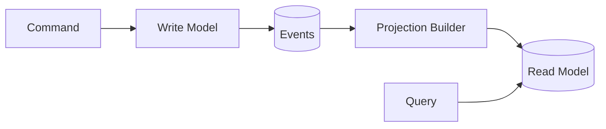

**Command Query Responsibility Segregation (CQRS)** separates the model that changes state
(commands) from the model that reads state (queries). This lets each side be optimized,
scaled, and stored independently.

## Commands vs. queries

| | Commands | Queries |
| --- | --- | --- |
| **Intent** | Change state | Read state |
| **Returns** | Acknowledgement / result | Data |
| **Model** | Rich domain model, enforces invariants | Read-optimized projections |
| **Scaling** | Scales with write load | Scales with read load |

## Read models

Query-side **projections** are built from events emitted by the write side, often kept in a
store shaped for fast reads. They are eventually consistent with the write model.

<Tip>
  Apply CQRS where read and write workloads differ significantly. For simple CRUD capabilities,
  a single model is usually the better trade-off.
</Tip>
