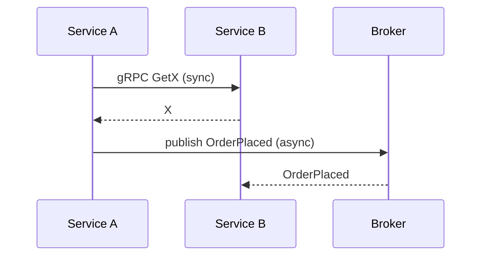

Services collaborate using two complementary styles. Choosing the right one per interaction
keeps the system responsive and resilient.

## Synchronous

Used when a caller needs an immediate answer (e.g. a query or a command that must confirm
before responding).

- Request/response over **HTTP** or **gRPC**.
- Simple to reason about, but couples caller availability to callee availability.
- Guarded with timeouts, retries, and circuit breakers.

## Asynchronous

Used for events and work that can complete independently of the caller.

- Messages/events published to a **message broker**.
- Decouples producers from consumers; absorbs load spikes.
- Enables event-driven workflows and the [Saga pattern](/architecture/saga-transactions).

<Note>
  Prefer asynchronous events for cross-service state changes; reserve synchronous calls for
  reads and operations that genuinely need an immediate result.
</Note>
