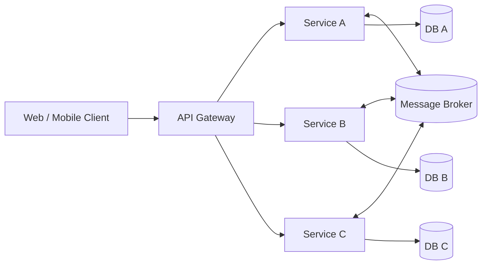

ShopNexus follows a **service-oriented architecture**: business capabilities are split into
independent services, each owning its data and exposing a contract that other services and
clients consume.

## High-level shape

## Core ideas

<CardGroup cols={2}>
  <Card title="SOA principles" icon="diagram-project" href="/architecture/soa-principles">
    Loose coupling, high cohesion, contract-first interaction.
  </Card>
  <Card title="Service layers" icon="layer-group" href="/architecture/service-layers">
    The layering and design patterns inside each service.
  </Card>
  <Card title="Inter-service communication" icon="arrows-left-right" href="/architecture/inter-service-communication">
    Synchronous and asynchronous communication styles.
  </Card>
  <Card title="Saga transactions" icon="route" href="/architecture/saga-transactions">
    Managing consistency across service boundaries.
  </Card>
  <Card title="CQRS" icon="arrows-split-up-and-left" href="/architecture/cqrs">
    Separating reads from writes for scalable queries.
  </Card>
  <Card title="Domain-driven design" icon="boxes-stacked" href="/architecture/domain-driven-design">
    Modeling business logic with bounded contexts.
  </Card>
</CardGroup>
